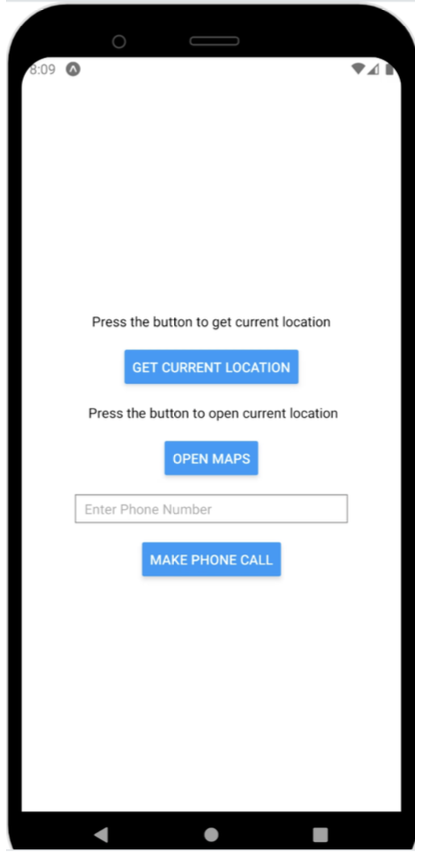

# Location and Bluetooth App

## Overview
This project is a React Native mobile application that integrates GPS location services, phone call functionality, and Bluetooth device discovery. It combines multiple features to provide a utility app with interactive capabilities.

 

 
---

## Features

### 1. Location Services
- **Location Permission:** Requests foreground location permissions upon app launch.
- **Current Location Retrieval:** Fetches the user's current latitude and longitude using the `expo-location` library.
- **Maps Integration:** Opens Google Maps at the user's current location.

### 2. Phone Call Functionality
- Accepts user input for a phone number.
- Initiates a phone call using the device's native dialer via the `Linking` API.

### 3. Bluetooth Device Discovery
- **Bluetooth Initialization:** Uses the `react-native-ble-manager` library to manage Bluetooth functionality.
- **Device Scanning:** Initiates a Bluetooth device scan for 5 seconds and logs discovered devices.

---

## User Interface

### Components
- **Text Labels:** Display instructions and current location details.
- **Buttons:** Perform actions such as fetching location, opening maps, making a phone call, and discovering Bluetooth devices.
- **Text Input:** Allows users to input a phone number for the call functionality.

### Styling
The app is styled using a `StyleSheet` for a consistent layout:
- Center-aligned content for simplicity.
- Buttons and text inputs spaced for usability.
- Margin adjustments for better visual hierarchy.

---

## Technologies Used
- **React Native**: Framework for building the cross-platform mobile app.
- **Expo Location**: Library for accessing device location services.
- **Expo Intent Launcher**: Helps with platform-specific intent handling (Android).
- **React Native BLE Manager**: Library for managing Bluetooth functionalities.
- **Linking API**: For deep linking to external apps like Maps and Dialer.

---

## Key Takeaways
- Leveraging React Native's component structure simplifies the development of feature-rich apps.
- Integration with external libraries like `expo-location` and `react-native-ble-manager` extends app capabilities.
- Handling permissions gracefully ensures better user experience and app reliability.

Feel free to build upon this project by adding features like Bluetooth pairing, historical location tracking, or a more robust phone call history log!
